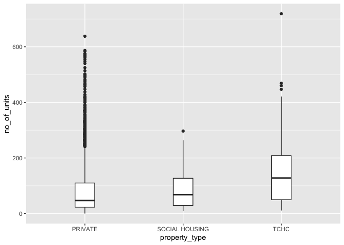

Mini Data-Analysis Deliverable 1
================

# Welcome to your (maybe) first-ever data analysis project!

And hopefully the first of many. Let’s get started:

1.  Install the [`datateachr`](https://github.com/UBC-MDS/datateachr)
    package by typing the following into your **R terminal**:

<!-- -->

    install.packages("devtools")
    devtools::install_github("UBC-MDS/datateachr")

2.  Load the packages below.

``` r
library(datateachr)
library(tidyverse)
```

    ## ── Attaching packages ─────────────────────────────────────── tidyverse 1.3.1 ──

    ## ✔ ggplot2 3.3.5     ✔ purrr   0.3.4
    ## ✔ tibble  3.1.4     ✔ dplyr   1.0.8
    ## ✔ tidyr   1.1.3     ✔ stringr 1.4.0
    ## ✔ readr   1.4.0     ✔ forcats 0.5.1

    ## Warning: package 'dplyr' was built under R version 4.0.5

    ## ── Conflicts ────────────────────────────────────────── tidyverse_conflicts() ──
    ## ✖ dplyr::filter() masks stats::filter()
    ## ✖ dplyr::lag()    masks stats::lag()

``` r
library(dplyr)
library(cowplot)
```

3.  Make a repository in the <https://github.com/stat545ubc-2022>
    Organization. You will be working with this repository for the
    entire data analysis project. You can either make it public, or make
    it private and add the TA’s and Lucy as collaborators. A link to
    help you create a private repository is available on the
    \#collaborative-project Slack channel.

# Instructions

## For Both Milestones

-   Each milestone is worth 45 points. The number of points allocated to
    each task will be annotated within each deliverable. Tasks that are
    more challenging will often be allocated more points.

-   10 points will be allocated to the reproducibility, cleanliness, and
    coherence of the overall analysis. While the two milestones will be
    submitted as independent deliverables, the analysis itself is a
    continuum - think of it as two chapters to a story. Each chapter, or
    in this case, portion of your analysis, should be easily followed
    through by someone unfamiliar with the content.
    [Here](https://swcarpentry.github.io/r-novice-inflammation/06-best-practices-R/)
    is a good resource for what constitutes “good code”. Learning good
    coding practices early in your career will save you hassle later on!

## For Milestone 1

**To complete this milestone**, edit [this very `.Rmd`
file](https://raw.githubusercontent.com/UBC-STAT/stat545.stat.ubc.ca/master/content/mini-project/mini-project-1.Rmd)
directly. Fill in the sections that are tagged with
`<!--- start your work below --->`.

**To submit this milestone**, make sure to knit this `.Rmd` file to an
`.md` file by changing the YAML output settings from
`output: html_document` to `output: github_document`. Commit and push
all of your work to the mini-analysis GitHub repository you made
earlier, and tag a release on GitHub. Then, submit a link to your tagged
release on canvas.

**Points**: This milestone is worth 45 points: 43 for your analysis, 1
point for having your Milestone 1 document knit error-free, and 1 point
for tagging your release on Github.

# Learning Objectives

By the end of this milestone, you should:

-   Become familiar with your dataset of choosing
-   Select 4 questions that you would like to answer with your data
-   Generate a reproducible and clear report using R Markdown
-   Become familiar with manipulating and summarizing your data in
    tibbles using `dplyr`, with a research question in mind.

# Task 1: Choose your favorite dataset (10 points)

The `datateachr` package by Hayley Boyce and Jordan Bourak currently
composed of 7 semi-tidy datasets for educational purposes. Here is a
brief description of each dataset:

-   *apt_buildings*: Acquired courtesy of The City of Toronto’s Open
    Data Portal. It currently has 3455 rows and 37 columns.

-   *building_permits*: Acquired courtesy of The City of Vancouver’s
    Open Data Portal. It currently has 20680 rows and 14 columns.

-   *cancer_sample*: Acquired courtesy of UCI Machine Learning
    Repository. It currently has 569 rows and 32 columns.

-   *flow_sample*: Acquired courtesy of The Government of Canada’s
    Historical Hydrometric Database. It currently has 218 rows and 7
    columns.

-   *parking_meters*: Acquired courtesy of The City of Vancouver’s Open
    Data Portal. It currently has 10032 rows and 22 columns.

-   *steam_games*: Acquired courtesy of Kaggle. It currently has 40833
    rows and 21 columns.

-   *vancouver_trees*: Acquired courtesy of The City of Vancouver’s Open
    Data Portal. It currently has 146611 rows and 20 columns.

**Things to keep in mind**

-   We hope that this project will serve as practice for carrying our
    your own *independent* data analysis. Remember to comment your code,
    be explicit about what you are doing, and write notes in this
    markdown document when you feel that context is required. As you
    advance in the project, prompts and hints to do this will be
    diminished - it’ll be up to you!

-   Before choosing a dataset, you should always keep in mind **your
    goal**, or in other ways, *what you wish to achieve with this data*.
    This mini data-analysis project focuses on *data wrangling*,
    *tidying*, and *visualization*. In short, it’s a way for you to get
    your feet wet with exploring data on your own.

And that is exactly the first thing that you will do!

1.1 Out of the 7 datasets available in the `datateachr` package, choose
**4** that appeal to you based on their description. Write your choices
below:

**Note**: We encourage you to use the ones in the `datateachr` package,
but if you have a dataset that you’d really like to use, you can include
it here. But, please check with a member of the teaching team to see
whether the dataset is of appropriate complexity. Also, include a
**brief** description of the dataset here to help the teaching team
understand your data.

<!-------------------------- Start your work below ---------------------------->

## The four selected datasets

Among the 7 semi-tidy datasets, we will select 4 which we will be
examining further for this data analysis project.

1: apt_buildings 2: flow_sample 3: parking_meters 4: cancer_sample
<!----------------------------------------------------------------------------->

1.2 One way to narrowing down your selection is to *explore* the
datasets. Use your knowledge of dplyr to find out at least *3*
attributes about each of these datasets (an attribute is something such
as number of rows, variables, class type…). The goal here is to have an
idea of *what the data looks like*.

*Hint:* This is one of those times when you should think about the
cleanliness of your analysis. I added a single code chunk for you below,
but do you want to use more than one? Would you like to write more
comments outside of the code chunk?

<!-------------------------- Start your work below ---------------------------->

## Exploring the datasets

To explore the datasets, we will be using the functions *glimpse* and
*class* to find out at least *3* attributes (number of rows, number of
columns, and the class type) about each of these datasets. As the name
suggests, the *dplyr* function *glimpse* shows a glimpse of the dataset
you are working with. Beyond the number of rows and columns, it also
shows you the name of columns and what the data will look like. The
function *class* helps reveal the class type for the dataset.

### apt_buildings

``` r
### EXPLORE HERE ###
glimpse(apt_buildings)
```

    ## Rows: 3,455
    ## Columns: 37
    ## $ id                               <dbl> 10359, 10360, 10361, 10362, 10363, 10…
    ## $ air_conditioning                 <chr> "NONE", "NONE", "NONE", "NONE", "NONE…
    ## $ amenities                        <chr> "Outdoor rec facilities", "Outdoor po…
    ## $ balconies                        <chr> "YES", "YES", "YES", "YES", "NO", "NO…
    ## $ barrier_free_accessibilty_entr   <chr> "YES", "NO", "NO", "YES", "NO", "NO",…
    ## $ bike_parking                     <chr> "0 indoor parking spots and 10 outdoo…
    ## $ exterior_fire_escape             <chr> "NO", "NO", "NO", "YES", "NO", NA, "N…
    ## $ fire_alarm                       <chr> "YES", "YES", "YES", "YES", "YES", "Y…
    ## $ garbage_chutes                   <chr> "YES", "YES", "NO", "NO", "NO", "NO",…
    ## $ heating_type                     <chr> "HOT WATER", "HOT WATER", "HOT WATER"…
    ## $ intercom                         <chr> "YES", "YES", "YES", "YES", "YES", "Y…
    ## $ laundry_room                     <chr> "YES", "YES", "YES", "YES", "YES", "Y…
    ## $ locker_or_storage_room           <chr> "NO", "YES", "YES", "YES", "NO", "YES…
    ## $ no_of_elevators                  <dbl> 3, 3, 0, 1, 0, 0, 0, 2, 4, 2, 0, 2, 2…
    ## $ parking_type                     <chr> "Underground Garage , Garage accessib…
    ## $ pets_allowed                     <chr> "YES", "YES", "YES", "YES", "YES", "Y…
    ## $ prop_management_company_name     <chr> NA, "SCHICKEDANZ BROS. PROPERTIES", N…
    ## $ property_type                    <chr> "PRIVATE", "PRIVATE", "PRIVATE", "PRI…
    ## $ rsn                              <dbl> 4154812, 4154815, 4155295, 4155309, 4…
    ## $ separate_gas_meters              <chr> "NO", "NO", "NO", "NO", "NO", "NO", "…
    ## $ separate_hydro_meters            <chr> "YES", "YES", "YES", "YES", "YES", "Y…
    ## $ separate_water_meters            <chr> "NO", "NO", "NO", "NO", "NO", "NO", "…
    ## $ site_address                     <chr> "65  FOREST MANOR RD", "70  CLIPPER R…
    ## $ sprinkler_system                 <chr> "YES", "YES", "NO", "YES", "NO", "NO"…
    ## $ visitor_parking                  <chr> "PAID", "FREE", "UNAVAILABLE", "UNAVA…
    ## $ ward                             <chr> "17", "17", "03", "03", "02", "02", "…
    ## $ window_type                      <chr> "DOUBLE PANE", "DOUBLE PANE", "DOUBLE…
    ## $ year_built                       <dbl> 1967, 1970, 1927, 1959, 1943, 1952, 1…
    ## $ year_registered                  <dbl> 2017, 2017, 2017, 2017, 2017, NA, 201…
    ## $ no_of_storeys                    <dbl> 17, 14, 4, 5, 4, 4, 4, 7, 32, 4, 4, 7…
    ## $ emergency_power                  <chr> "NO", "YES", "NO", "NO", "NO", "NO", …
    ## $ `non-smoking_building`           <chr> "YES", "NO", "YES", "YES", "YES", "NO…
    ## $ no_of_units                      <dbl> 218, 206, 34, 42, 25, 34, 14, 105, 57…
    ## $ no_of_accessible_parking_spaces  <dbl> 8, 10, 20, 42, 12, 0, 5, 1, 1, 6, 12,…
    ## $ facilities_available             <chr> "Recycling bins", "Green Bin / Organi…
    ## $ cooling_room                     <chr> "NO", "NO", "NO", "NO", "NO", "NO", "…
    ## $ no_barrier_free_accessible_units <dbl> 2, 0, 0, 42, 0, NA, 14, 0, 0, 1, 25, …

``` r
class(apt_buildings)
```

    ## [1] "tbl_df"     "tbl"        "data.frame"

The attributes of the **apt_buildings** dataset are: 3,455 rows, 37
columns, and it was originally a data.frame that has been coerced into a
tibble.

### flow_sample

``` r
glimpse(flow_sample)
```

    ## Rows: 218
    ## Columns: 7
    ## $ station_id   <chr> "05BB001", "05BB001", "05BB001", "05BB001", "05BB001", "0…
    ## $ year         <dbl> 1909, 1910, 1911, 1912, 1913, 1914, 1915, 1916, 1917, 191…
    ## $ extreme_type <chr> "maximum", "maximum", "maximum", "maximum", "maximum", "m…
    ## $ month        <dbl> 7, 6, 6, 8, 6, 6, 6, 6, 6, 6, 6, 7, 6, 6, 6, 7, 5, 7, 6, …
    ## $ day          <dbl> 7, 12, 14, 25, 11, 18, 27, 20, 17, 15, 22, 3, 9, 5, 14, 5…
    ## $ flow         <dbl> 314, 230, 264, 174, 232, 214, 236, 309, 174, 345, 185, 24…
    ## $ sym          <chr> NA, NA, NA, NA, NA, NA, NA, NA, NA, NA, NA, NA, NA, NA, N…

``` r
class(flow_sample)
```

    ## [1] "tbl_df"     "tbl"        "data.frame"

The attributes of the **flow_sample** dataset are: 218 rows, 7 columns,
and it was originally a data.frame that has been coerced into a tibble.

### parking_meters

``` r
glimpse(parking_meters)
```

    ## Rows: 10,032
    ## Columns: 22
    ## $ meter_head     <chr> "Twin", "Pay Station", "Twin", "Single", "Twin", "Twin"…
    ## $ r_mf_9a_6p     <chr> "$2.00", "$1.00", "$1.00", "$1.00", "$2.00", "$2.00", "…
    ## $ r_mf_6p_10     <chr> "$4.00", "$1.00", "$1.00", "$1.00", "$1.00", "$1.00", "…
    ## $ r_sa_9a_6p     <chr> "$2.00", "$1.00", "$1.00", "$1.00", "$2.00", "$2.00", "…
    ## $ r_sa_6p_10     <chr> "$4.00", "$1.00", "$1.00", "$1.00", "$1.00", "$1.00", "…
    ## $ r_su_9a_6p     <chr> "$2.00", "$1.00", "$1.00", "$1.00", "$2.00", "$2.00", "…
    ## $ r_su_6p_10     <chr> "$4.00", "$1.00", "$1.00", "$1.00", "$1.00", "$1.00", "…
    ## $ rate_misc      <chr> NA, "$ .50", NA, NA, NA, NA, NA, NA, NA, NA, NA, NA, NA…
    ## $ time_in_effect <chr> "METER IN EFFECT: 9:00 AM TO 10:00 PM", "METER IN EFFEC…
    ## $ t_mf_9a_6p     <chr> "2 Hr", "10 Hrs", "2 Hr", "2 Hr", "2 Hr", "3 Hr", "2 Hr…
    ## $ t_mf_6p_10     <chr> "4 Hr", "10 Hrs", "4 Hr", "4 Hr", "4 Hr", "4 Hr", "4 Hr…
    ## $ t_sa_9a_6p     <chr> "2 Hr", "10 Hrs", "2 Hr", "2 Hr", "2 Hr", "3 Hr", "2 Hr…
    ## $ t_sa_6p_10     <chr> "4 Hr", "10 Hrs", "4 Hr", "4 Hr", "4 Hr", "4 Hr", "4 Hr…
    ## $ t_su_9a_6p     <chr> "2 Hr", "10 Hrs", "2 Hr", "2 Hr", "2 Hr", "3 Hr", "2 Hr…
    ## $ t_su_6p_10     <chr> "4 Hr", "10 Hrs", "4 Hr", "4 Hr", "4 Hr", "4 Hr", "4 Hr…
    ## $ time_misc      <chr> NA, "No Time Limit", NA, NA, NA, NA, NA, NA, NA, NA, NA…
    ## $ credit_card    <chr> "No", "Yes", "No", "No", "No", "No", "No", "No", "No", …
    ## $ pay_phone      <chr> "66890", "59916", "57042", "57159", "51104", "60868", "…
    ## $ longitude      <dbl> -123.1289, -123.0982, -123.1013, -123.1862, -123.1278, …
    ## $ latitude       <dbl> 49.28690, 49.27215, 49.25468, 49.26341, 49.26354, 49.27…
    ## $ geo_local_area <chr> "West End", "Strathcona", "Riley Park", "West Point Gre…
    ## $ meter_id       <chr> "670805", "471405", "C80145", "D03704", "301023", "5913…

``` r
class(parking_meters)
```

    ## [1] "tbl_df"     "tbl"        "data.frame"

The attributes of the **parking_meters** dataset are: 10,032 rows, 22
columns, and it was originally a data.frame that has been coerced into a
tibble.

### cancer_sample

``` r
glimpse(cancer_sample)
```

    ## Rows: 569
    ## Columns: 32
    ## $ ID                      <dbl> 842302, 842517, 84300903, 84348301, 84358402, …
    ## $ diagnosis               <chr> "M", "M", "M", "M", "M", "M", "M", "M", "M", "…
    ## $ radius_mean             <dbl> 17.990, 20.570, 19.690, 11.420, 20.290, 12.450…
    ## $ texture_mean            <dbl> 10.38, 17.77, 21.25, 20.38, 14.34, 15.70, 19.9…
    ## $ perimeter_mean          <dbl> 122.80, 132.90, 130.00, 77.58, 135.10, 82.57, …
    ## $ area_mean               <dbl> 1001.0, 1326.0, 1203.0, 386.1, 1297.0, 477.1, …
    ## $ smoothness_mean         <dbl> 0.11840, 0.08474, 0.10960, 0.14250, 0.10030, 0…
    ## $ compactness_mean        <dbl> 0.27760, 0.07864, 0.15990, 0.28390, 0.13280, 0…
    ## $ concavity_mean          <dbl> 0.30010, 0.08690, 0.19740, 0.24140, 0.19800, 0…
    ## $ concave_points_mean     <dbl> 0.14710, 0.07017, 0.12790, 0.10520, 0.10430, 0…
    ## $ symmetry_mean           <dbl> 0.2419, 0.1812, 0.2069, 0.2597, 0.1809, 0.2087…
    ## $ fractal_dimension_mean  <dbl> 0.07871, 0.05667, 0.05999, 0.09744, 0.05883, 0…
    ## $ radius_se               <dbl> 1.0950, 0.5435, 0.7456, 0.4956, 0.7572, 0.3345…
    ## $ texture_se              <dbl> 0.9053, 0.7339, 0.7869, 1.1560, 0.7813, 0.8902…
    ## $ perimeter_se            <dbl> 8.589, 3.398, 4.585, 3.445, 5.438, 2.217, 3.18…
    ## $ area_se                 <dbl> 153.40, 74.08, 94.03, 27.23, 94.44, 27.19, 53.…
    ## $ smoothness_se           <dbl> 0.006399, 0.005225, 0.006150, 0.009110, 0.0114…
    ## $ compactness_se          <dbl> 0.049040, 0.013080, 0.040060, 0.074580, 0.0246…
    ## $ concavity_se            <dbl> 0.05373, 0.01860, 0.03832, 0.05661, 0.05688, 0…
    ## $ concave_points_se       <dbl> 0.015870, 0.013400, 0.020580, 0.018670, 0.0188…
    ## $ symmetry_se             <dbl> 0.03003, 0.01389, 0.02250, 0.05963, 0.01756, 0…
    ## $ fractal_dimension_se    <dbl> 0.006193, 0.003532, 0.004571, 0.009208, 0.0051…
    ## $ radius_worst            <dbl> 25.38, 24.99, 23.57, 14.91, 22.54, 15.47, 22.8…
    ## $ texture_worst           <dbl> 17.33, 23.41, 25.53, 26.50, 16.67, 23.75, 27.6…
    ## $ perimeter_worst         <dbl> 184.60, 158.80, 152.50, 98.87, 152.20, 103.40,…
    ## $ area_worst              <dbl> 2019.0, 1956.0, 1709.0, 567.7, 1575.0, 741.6, …
    ## $ smoothness_worst        <dbl> 0.1622, 0.1238, 0.1444, 0.2098, 0.1374, 0.1791…
    ## $ compactness_worst       <dbl> 0.6656, 0.1866, 0.4245, 0.8663, 0.2050, 0.5249…
    ## $ concavity_worst         <dbl> 0.71190, 0.24160, 0.45040, 0.68690, 0.40000, 0…
    ## $ concave_points_worst    <dbl> 0.26540, 0.18600, 0.24300, 0.25750, 0.16250, 0…
    ## $ symmetry_worst          <dbl> 0.4601, 0.2750, 0.3613, 0.6638, 0.2364, 0.3985…
    ## $ fractal_dimension_worst <dbl> 0.11890, 0.08902, 0.08758, 0.17300, 0.07678, 0…

``` r
class(cancer_sample)
```

    ## [1] "spec_tbl_df" "tbl_df"      "tbl"         "data.frame"

The attributes of the **cancer_sample** dataset are: 569 rows, 32
columns, and it was originally a data.frame that has been coerced into a
tibble.
<!----------------------------------------------------------------------------->

1.3 Now that you’ve explored the 4 datasets that you were initially most
interested in, let’s narrow it down to 2. What lead you to choose these
2? Briefly explain your choices below, and feel free to include any code
in your explanation.

<!-------------------------- Start your work below ---------------------------->

## Narrowing Down to 2 Datasets

After getting a brief understanding of the datasets, we will narrow down
to 2 datasets.

### Selected datasets

**apt_buildings** & **cancer_sample**

### Explanation of Choices

Both of these datasets are the most similar to datasets I am familiar
working with and will continue to work with for my thesis.  
My previous datasets have a mix of categorical and numerical variables
(similar to the apt_buildings). My previous datasets typically have many
different columns and different parameters to consider (similar to
cancer_sample).
<!----------------------------------------------------------------------------->

1.4 Time for the final decision! Going back to the beginning, it’s
important to have an *end goal* in mind. For example, if I had chosen
the `titanic` dataset for my project, I might’ve wanted to explore the
relationship between survival and other variables. Try to think of 1
research question that you would want to answer with each dataset. Note
them down below, and make your final choice based on what seems more
interesting to you!

<!-------------------------- Start your work below ---------------------------->

## Final Decision

apt_buildings: Does the number of units in a building influence the
number of acessible parking spaces? cancer_sample: What is the
relationship between radius and texture mean?

The most interesting dataset is the **apt_buildings**.  
<!----------------------------------------------------------------------------->

# Important note

Read Tasks 2 and 3 *fully* before starting to complete either of them.
Probably also a good point to grab a coffee to get ready for the fun
part!

This project is semi-guided, but meant to be *independent*. For this
reason, you will complete tasks 2 and 3 below (under the **START HERE**
mark) as if you were writing your own exploratory data analysis report,
and this guidance never existed! Feel free to add a brief introduction
section to your project, format the document with markdown syntax as you
deem appropriate, and structure the analysis as you deem appropriate.
Remember, marks will be awarded for completion of the 4 tasks, but 10
points of the whole project are allocated to a reproducible and clean
analysis. If you feel lost, you can find a sample data analysis
[here](https://www.kaggle.com/headsortails/tidy-titarnic) to have a
better idea. However, bear in mind that it is **just an example** and
you will not be required to have that level of complexity in your
project.

# Task 2: Exploring your dataset (15 points)

If we rewind and go back to the learning objectives, you’ll see that by
the end of this deliverable, you should have formulated *4* research
questions about your data that you may want to answer during your
project. However, it may be handy to do some more exploration on your
dataset of choice before creating these questions - by looking at the
data, you may get more ideas. **Before you start this task, read all
instructions carefully until you reach START HERE under Task 3**.

2.1 Complete *4 out of the following 8 exercises* to dive deeper into
your data. All datasets are different and therefore, not all of these
tasks may make sense for your data - which is why you should only answer
*4*. Use *dplyr* and *ggplot*.

1.  Plot the distribution of a numeric variable.
2.  Create a new variable based on other variables in your data (only if
    it makes sense)
3.  Investigate how many missing values there are per variable. Can you
    find a way to plot this?
4.  Explore the relationship between 2 variables in a plot.
5.  Filter observations in your data according to your own criteria.
    Think of what you’d like to explore - again, if this was the
    `titanic` dataset, I may want to narrow my search down to passengers
    born in a particular year…
6.  Use a boxplot to look at the frequency of different observations
    within a single variable. You can do this for more than one variable
    if you wish!
7.  Make a new tibble with a subset of your data, with variables and
    observations that you are interested in exploring.
8.  Use a density plot to explore any of your variables (that are
    suitable for this type of plot).

2.2 For each of the 4 exercises that you complete, provide a *brief
explanation* of why you chose that exercise in relation to your data (in
other words, why does it make sense to do that?), and sufficient
comments for a reader to understand your reasoning and code.

<!-------------------------- Start your work below ---------------------------->

## Diving Deeper into the Data

Here, we will go more in-depth of the naming of the graphs and functions
used to get a better idea of how we can further explore our dataset. The
purpose of this exercise is visualize the dataset by comparing different
parameters and using different *ggplot* functions so we can develop *4*
research questions. We will complete *4 out of the 8 tasks* to explore
our data.

### 1st selected task: Plotting the distribution of a numeric variable.

We will name this plot *unts_dstrbtn*. We will do this using the
*ggplot* and *geom_histogram* function. We will be examining the
**no_of_units** distribution to see if there is variability of this
parameter. If there is not a notable spread, then it wouldn’t be worth
examining how this variable relates to another.

``` r
unts_dstrbtn <- ggplot(apt_buildings, aes(x=no_of_units)) + geom_histogram()
print(unts_dstrbtn)
```

    ## `stat_bin()` using `bins = 30`. Pick better value with `binwidth`.

<!-- -->

It is always good practice to **name our plots** rather than simply
outputting them onto the file. This will make it much easier to come
back to this plot later if we need to add another geom layer for
example. Since we are naming the plot, we will need to use the function
*print* to display the plot onto the file after we have knitted. Another
helpful practice is to **remove vowels** from long variable names to
shorten them.

### 2nd selected task: Explore the relationship between 2 variables in a plot.

We will name this plot *unts_prkng_plt*. We will be using the *ggplot*
and *geom_point* function. We will be examining the relationship between
**no_of_units** and **no_of_accessible_parking_spaces** because this was
the original research question I had written down in 1.4.

``` r
unts_prkng_plt <- ggplot(apt_buildings, aes(x=no_of_units, y=no_of_accessible_parking_spaces)) + geom_point() 
print(unts_prkng_plt)
```

    ## Warning: Removed 123 rows containing missing values (geom_point).

<!-- -->

Upon examination of the plot, it is clear that **one** apartment has
4000 units, which makes it difficult to examine the relationship.
Therefore, using the *filter* function, we will remove this outlier and
then plot the remaining apartments. We will name this new plot
*unts_prkng_n4K_plt*

``` r
unts_prkng_n4K_plt <- apt_buildings %>% 
  # remove the apartment with <4000 units 
  filter(no_of_units<4000) %>%
  ggplot(aes(x=no_of_units, y=no_of_accessible_parking_spaces)) + geom_point() 
print(unts_prkng_n4K_plt)
```

    ## Warning: Removed 123 rows containing missing values (geom_point).

<!-- -->

Here, we used the pipe (*%\>%*) to condense our code. This can be
interpreted as “and then” as you are reading the code. This approach
above is a condense and successful approach in plotting the number of
units against the number of accessible parking spaces while omitting the
4000 unit outlier. Using a pipe is best when calling multiple functions,
as it can combine them into a single statement. This is preferred
approach to creating an entirely new dataset and then making the plot on
a separate chunk of code, like below:

``` r
# Creating a separate dataset which filters out the outlier
apt_buildings_no4K <- filter(apt_buildings, no_of_units<4000)
# Plot using the newly made dataset  
unts_prkng_n4K_plt_2 <- ggplot(apt_buildings_no4K, aes(x=no_of_units, y=no_of_accessible_parking_spaces)) + geom_point() 
print(unts_prkng_n4K_plt_2)
```

    ## Warning: Removed 123 rows containing missing values (geom_point).

<!-- -->

As you can see, both approaches produce the exact same plot, but the
former is preferred given its conciseness and prevents you from
cluttering your workspace.

### 3rd selected task: Use a boxplot to look at the frequency of different observations within a single variable.

We will name this plot *units_property_boxplot*. We will be do this
using the *ggplot* and *geom_boxplot* function. We will examine the
no_of_units and property_type variables. This helps to see if the
property type will impact the number of units. Once again, we will omit
the apartment with 4000 units.

``` r
parking_property_boxplot <- ggplot(apt_buildings_no4K, aes(property_type, no_of_units)) + geom_boxplot(width=0.2) 
print(parking_property_boxplot)
```

<!-- -->

### 4th selected task: Use a density plot to explore any of your variables

We will name this plot *Acc_parking_density*. We will be using the
*ggplot* and *geom_density* functions. Similar to to plotting the
distribution of the units, this will allow us to see if there is enough
of a spread of this variable to see its relation to another parameter.

``` r
Acc_parking_density <- ggplot(apt_buildings, aes(x=no_of_accessible_parking_spaces)) + geom_density()
print(Acc_parking_density)
```

    ## Warning: Removed 123 rows containing non-finite values (stat_density).

<!-- -->
<!----------------------------------------------------------------------------->

# Task 3: Write your research questions (5 points)

So far, you have chosen a dataset and gotten familiar with it through
exploring the data. Now it’s time to figure out 4 research questions
that you would like to answer with your data! Write the 4 questions and
any additional comments at the end of this deliverable. These questions
are not necessarily set in stone - TAs will review them and give you
feedback; therefore, you may choose to pursue them as they are for the
rest of the project, or make modifications!

<!--- *****START HERE***** --->

1.  How does the age of the apartment (based on year built) impact the
    apartment’s presence of emergency power?
2.  How does property type influence the number of stories in an
    apartment, and the relationship between stories and units?
3.  Are the differences between apartment age (based on year built) that
    allow and don’t allow pets?
4.  How does the number of units impact the apartment’s visitor parking
    availability?

# Task 4: Process and summarize your data (13 points)

From Task 2, you should have an idea of the basic structure of your
dataset (e.g. number of rows and columns, class types, etc.). Here, we
will start investigating your data more in-depth using various data
manipulation functions.

### 1.1 (10 points)

Now, for each of your four research questions, choose one task from
options 1-4 (summarizing), and one other task from 4-8 (graphing). You
should have 2 tasks done for each research question (8 total). Make sure
it makes sense to do them! (e.g. don’t use a numerical variables for a
task that needs a categorical variable.). Comment on why each task helps
(or doesn’t!) answer the corresponding research question.

Ensure that the output of each operation is printed!

**Summarizing:**

1.  Compute the *range*, *mean*, and *two other summary statistics* of
    **one numerical variable** across the groups of **one categorical
    variable** from your data.
2.  Compute the number of observations for at least one of your
    categorical variables. Do not use the function `table()`!
3.  Create a categorical variable with 3 or more groups from an existing
    numerical variable. You can use this new variable in the other
    tasks! *An example: age in years into “child, teen, adult, senior”.*
4.  Based on two categorical variables, calculate two summary statistics
    of your choosing.

**Graphing:**

5.  Create a graph out of summarized variables that has at least two
    geom layers.
6.  Create a graph of your choosing, make one of the axes logarithmic,
    and format the axes labels so that they are “pretty” or easier to
    read.
7.  Make a graph where it makes sense to customize the alpha
    transparency.
8.  Create 3 histograms out of summarized variables, with each histogram
    having different sized bins. Pick the “best” one and explain why it
    is the best.

Make sure it’s clear what research question you are doing each operation
for!

<!------------------------- Start your work below ----------------------------->

#### Research Question 1

How does the age of the apartment (based on year built) impact the
apartment’s presence of emergency power?

##### Summarizing Task

Computing the *range*, *mean*, *median*, and *standard deviation* of the
*year_built* across the *emergency_power* categorical variable.

Using the *range* function will output a vector made of two numbers (the
lowest and highest value among the selected column). Unfortunately, I
was not able to output both ranges (the year built for apartments with
and without emergency power) in a single statement. Additionally, the
*range* function only works if we call on a numeric vector, which makes
it difficult to execute this task without creating a separate dataset.
Using comments within the code, I will outline the steps for apartments
that do have emergency power (“YES” under the *emergency_power* column)
below.

**Apartments with Emergency Power - Year Built - Range:**

``` r
# filter the dataset so it only has apartments with emergency power
emerg_pwr_ys <- filter(apt_buildings, emergency_power=="YES" )

# find the range of year_built across this new dataset
emerg_pwr_ys_rng <- range(emerg_pwr_ys$year_built, na.rm = TRUE)
print(emerg_pwr_ys_rng)
```

    ## [1] 1900 2019

The *$* function allows us to access a particular variable in a dataset.
In this context, we were accessing the *year_built* variable within the
*emerg_pwr_ys* dataset to find the range. The *na.rm = TRUE* ensures
that NA values are omitted (by default, the *range* function sets this
to FALSE).

We can use the same process for apartments that do not have emergency
power.

**Apartments without Emergency Power - Year Built - Range:**

``` r
# filter the dataset so it only has apartments without emergency power
emerg_pwr_no <- filter(apt_buildings, emergency_power=="NO" )

# calculate and print the range of year_built across this new dataset
emerg_pwr_no_rng <- range(emerg_pwr_no$year_built, na.rm = TRUE)
print(emerg_pwr_no_rng)
```

    ## [1] 1805 2016

To find the *mean, standard deviation (sd), and median*, we will
summarize these values into a table for seamless comparison between the
two types of apartments.

**Emergency Power Summary - Year Built - Mean, SD, Median:**

``` r
# mean, sd, median
yr_blt_smmry <- apt_buildings %>% 
  # remove rows where emergency_power is NA 
  filter(!is.na(emergency_power)) %>%
  group_by(`emergency_power`) %>%
  summarise(year_mean = mean(year_built, na.rm = TRUE), year_sd=sd(year_built, na.rm= TRUE), year_median=median(year_built, na.rm=TRUE))
print(yr_blt_smmry)
```

    ## # A tibble: 2 × 4
    ##   emergency_power year_mean year_sd year_median
    ##   <chr>               <dbl>   <dbl>       <dbl>
    ## 1 NO                  1956.    18.0        1959
    ## 2 YES                 1970.    17.4        1968

**Why this task helps:** This summarizing task helps demonstrate the
relationship between year an apartment was built and the presence of an
emergency room. On average, buildings with emergency power were built
more recent than those without emergency power.

##### Graphing Task

Create a graph out of summarized variables (*year_built* and
*visitor_parking*) that has at least two geom layers (*geom_point* and
*geom_boxplot*).

**Emergency Power and Year Built - Box Plot**

``` r
yr_blt_vstr_prkng <- apt_buildings %>%
  # remove the rows where visitor_parking is NA
  filter(!is.na(emergency_power)) %>%
  ggplot(aes(emergency_power, year_built)) + geom_boxplot(width=0.2) + geom_point() 
print(yr_blt_vstr_prkng)
```

    ## Warning: Removed 2 rows containing non-finite values (stat_boxplot).

    ## Warning: Removed 2 rows containing missing values (geom_point).

<!-- -->

**Why this task helps:** This graphing tasks helps show that the year
built does have an influence on the type of visitor parking. The medians
(indicated by the horizontal black line) are slightly different. This
graph also helps us see the high variability for year built with the
both types of apartments (with and without emergency power)

#### Research Question 2

How does property type influence the number of stories in an apartment,
and the relationship between stories and units?

##### Summarizing Task

Computing the *range*, *mean*, *median*, and *standard deviation* of the
*no_of_storeys* numerical variable across the *property_type*
categorical variable.

Similar to the summarizing task for **Research Question 1**, we will
separate the *range* operation for each *property type* category.

**PRIVATE - Number of Storeys - Range:**

``` r
# filter the dataset so it only has PRIVATE apartments 
prprty_typ_prvt <- filter(apt_buildings, property_type=="PRIVATE" )

# calculate and print the range of no_of_storeys across this new dataset
prprty_typ_prvt_rng <- range(prprty_typ_prvt$no_of_storeys, na.rm = TRUE)
print(prprty_typ_prvt_rng)
```

    ## [1]  0 51

**SOCIAL HOUSING - Number of Storeys - Range:**

``` r
# filter the dataset so it only has SOCIAL HOUSING apartments 
prprty_typ_scl_hsng <- filter(apt_buildings, property_type=="SOCIAL HOUSING" )

# calculate and print the range of no_of_storeys across this new dataset
prprty_typ_scl_hsng_rng <- range(prprty_typ_scl_hsng$no_of_storeys, na.rm = TRUE)
print(prprty_typ_scl_hsng_rng)
```

    ## [1]  3 22

**TCHC - Number of Storeys - Range:**

``` r
# filter the dataset so it only has TCHC apartments 
prprty_typ_TCHC <- filter(apt_buildings, property_type=="TCHC" )

# calculate and print the range of no_of_storeys across this new dataset
prprty_typ_TCHC_rng <- range(prprty_typ_TCHC$no_of_storeys, na.rm = TRUE)
print(prprty_typ_TCHC_rng)
```

    ## [1]  3 41

Finding the *mean, sd, and median* will follow the same process as
**Research Question 1**.

**Property Type Summary - Number of Storeys - Mean, SD, Median:**

``` r
# mean, sd, median
prprty_typ_smmry <- apt_buildings %>% 
  group_by(`property_type`) %>%
  summarise(storey_mean = mean(no_of_storeys, na.rm = TRUE), storey_sd=sd(no_of_storeys, na.rm= TRUE), storey_median=median(no_of_storeys, na.rm=TRUE))
print(prprty_typ_smmry)
```

    ## # A tibble: 3 × 4
    ##   property_type  storey_mean storey_sd storey_median
    ##   <chr>                <dbl>     <dbl>         <dbl>
    ## 1 PRIVATE               7.63      6.40             4
    ## 2 SOCIAL HOUSING        6.58      3.79             5
    ## 3 TCHC                  9.55      5.93             8

**Why this task helps:** This summarizing task helps us show that the
property type does not greatly influence the number of stories in the
apartment as the means range from 6-9. However, it suggests that TCHC
typically has the most stories and Private ones have the lowest.

##### Graphing Task

Create a graph out of summarized variables (*no_of_storeys* and *no_of
units*, separated by *property_type*) that has at least two geom layers
(*geom_point* and *geom_smooth*). To create separate figures (per
property type) we use the *facet_wrap* function.

**Number of Storeys, Number of Units and Property Type - Group Plot**

``` r
strys_unts_prpty <- apt_buildings %>% 
  # remove the apartment with <4000 units 
  filter(no_of_units<4000) %>%
  ggplot(aes(no_of_storeys, no_of_units)) + facet_wrap(~property_type) + geom_point() + geom_smooth()
print(strys_unts_prpty)
```

    ## `geom_smooth()` using method = 'gam' and formula 'y ~ s(x, bs = "cs")'

<!-- -->

**Why this task helps:** This graphing task helps show that a linear
relationship between the number of stories and the number of units is
generally maintained across all three property types.

#### Research Question 3

Are the differences between apartment age (based on year built) that
allow and don’t allow pets?

##### Summarizing task

Compute the number of observations for at least one of your categorical
variables (*pets_allowed*). Do not use the function `table()`! We can
use the *count* function to accomplish this task.

**Pets Allowed - Count**

``` r
pets_count <- apt_buildings %>%
  # remove the rows where pets_allowed is NA
  filter(!is.na(pets_allowed)) %>%
  count(pets_allowed)
print(pets_count)
```

    ## # A tibble: 2 × 2
    ##   pets_allowed     n
    ##   <chr>        <int>
    ## 1 NO             601
    ## 2 YES           2764

**Why this task helps:** This summarizing task helps show how many
buildings allow and don’t allow pets. This helps understand if there are
enough apartments for each category (“yes” or “no”) to compare the two
types of apartments.

##### Graphing task

Create a graph out of summarized variables (*year_built* and
*pets_allowed*) that has at least two geom layers (*geom_point* and
*geom_boxplot*).

**Pets Allowed and Year Built - Box Plot**

``` r
pts_allwd_yr_blt <- apt_buildings %>%
  # remove the rows where pets_allowed is NA
  filter(!is.na(pets_allowed)) %>%
  ggplot(aes(pets_allowed, year_built)) + geom_boxplot(width=0.2) + geom_point() 
print(pts_allwd_yr_blt)
```

    ## Warning: Removed 2 rows containing non-finite values (stat_boxplot).

    ## Warning: Removed 2 rows containing missing values (geom_point).

<!-- -->

**Why this task helps:** This graph shows that there is not much of a
difference between the year built and its allowance of pets. In other
words, the year built does not influence the pet allowance in an
apartment. This is also helpful for research question 1.

#### Research Question 4

How does the number of units impact the apartment’s visitor parking
availability?

##### Summarizing Task

Computing the *range*, *mean*, *median*, and *standard deviation* of the
number of apartments across the *visitor_parking* categorical variable.

**BOTH range:**

``` r
# filter the dataset so it only has apartments with both visitor parkings
vstr_prkng_bth <- filter(apt_buildings, visitor_parking=="BOTH" )

# calculate and print the range of no_of_units across this new dataset
vstr_prkng_bth_rng <- range(vstr_prkng_bth$no_of_units, na.rm = TRUE)
print(vstr_prkng_bth_rng)
```

    ## [1]  10 719

**FREE range:**

``` r
# filter the dataset so it only has apartments with free visitor parkings
vstr_prkng_fr <- filter(apt_buildings, visitor_parking=="FREE")

# calculate and print the range of no_of_units across this new dataset
vstr_prkng_fr_rng <- range(vstr_prkng_fr$no_of_units, na.rm = TRUE)
print(vstr_prkng_fr_rng)
```

    ## [1]   10 4111

**PAID range:**

``` r
# filter the dataset so it only has apartments with paid visitor parkings
vstr_prkng_pd <- filter(apt_buildings, visitor_parking=="PAID")

# calculate and print the range of no_of_units across this new dataset
vstr_prkng_pd_rng <- range(vstr_prkng_pd$no_of_units, na.rm = TRUE)
print(vstr_prkng_pd_rng)
```

    ## [1]  11 638

**UNAVAILABLE range:**

``` r
# filter the dataset so it only has apartments with free visitor parkings
vstr_prkng_unvlbl <- filter(apt_buildings, visitor_parking=="UNAVAILABLE")

# calculate and print the range of no_of_units across this new dataset
vstr_prkng_unvlbl_rng <- range(vstr_prkng_unvlbl$no_of_units, na.rm = TRUE)
print(vstr_prkng_unvlbl_rng)
```

    ## [1]  10 575

**Visitor Parking Summary - Number of Units - Mean, SD, Median:**

``` r
# mean, sd, median
no_unts_smmry <- apt_buildings %>% 
  # remove rows where visitor_parking is NA 
  filter(!is.na(visitor_parking)) %>%
  group_by(`visitor_parking`) %>%
  summarise(no_unit_mean = mean(no_of_units, na.rm = TRUE), no_unit_sd=sd(no_of_units, na.rm= TRUE), no_unit_median=median(no_of_units, na.rm=TRUE))
print(no_unts_smmry)
```

    ## # A tibble: 4 × 4
    ##   visitor_parking no_unit_mean no_unit_sd no_unit_median
    ##   <chr>                  <dbl>      <dbl>          <dbl>
    ## 1 BOTH                   170.       119.            150 
    ## 2 FREE                   108.       138.             79 
    ## 3 PAID                   165.       127.            146.
    ## 4 UNAVAILABLE             42.8       53.2            28

**Why this task helps:** This summarizing task helps show how the number
of units vary between visitor parking status. We can see that the
unavailable visiting parking had the lowest number of units and the
highest number of units offered both kinds of visitor parking.

##### Graphing Task

Create 3 histograms out of summarized variables, with each histogram
having different sized bins. Pick the “best” one and explain why it is
the best. We can use the *geom_histogram* function to make our
historgrams, and edit the *binwidth* to adjust the size of bins. We can
display all of these plots together using the *plot_grid* function from
the *cowplot* library.

**Visitor Parking and Number of Units - Filled Histograms**

``` r
unit_hist_bin1 <- apt_buildings %>%
  # remove the apartments with <4000 units and visitor parking is NA
  filter(no_of_units<4000 & !is.na(visitor_parking)) %>%  
  ggplot(aes(no_of_units, fill=visitor_parking)) + geom_histogram(binwidth = 1)

unit_hist_bin5 <- apt_buildings %>%
  # remove the apartments with <4000 units and visitor parking is NA
  filter(no_of_units<4000 & !is.na(visitor_parking)) %>%  
  ggplot(aes(no_of_units, fill=visitor_parking)) + geom_histogram(binwidth = 5)

unit_hist_bin10 <- apt_buildings %>%
  # remove the apartments with <4000 units and visitor parking is NA
  filter(no_of_units<4000 & !is.na(visitor_parking)) %>%  
  ggplot(aes(no_of_units, fill=visitor_parking)) + geom_histogram(binwidth = 10)


combined_hist <- plot_grid(unit_hist_bin1, unit_hist_bin5, unit_hist_bin10, nrow = 3, labels = "AUTO")

print(combined_hist)
```

<!-- -->

Among the 3 histograms (A = bin-width 1, B = bin-width 5, C = bin-width
10), the bin-width of 10 is the ‘best’ one because it has the best
balance of spreading the bars both horizontally and vertically across
the graph.

``` r
print(unit_hist_bin10)
```

<!-- -->

**Why this task helps:** This histogram shows how the visitor parking
status can vary based on the number of units. For example, this graph
helps show that Free visitor parking seems to be present in greater
relative proportions as the number of units increase.

### 1.2 (3 points)

Based on the operations that you’ve completed, how much closer are you
to answering your research questions? Think about what aspects of your
research questions remain unclear. Can your research questions be
refined, now that you’ve investigated your data a bit more? Which
research questions are yielding interesting results?

<!-------------------------- Start your work below ---------------------------->

The operations have helped me come closer to answering my research
questions as we can see if there are relationships between different
parameters. For example, we know that the year that an apartment is
built has a slight impact on whether there is emergency power or not.
Additionally, the number of units may influence the type of visitor
parking available. On the other hand, there are a similar number of
stories across different property types and the allowance of pets does
not seem to be affected by the apartment’s age (based on year built).
There aren’t any aspects of the research questions that remain unclear,
but this is likely because the questions were fairly specific.
Therefore, I may need to revise these questions so they cover a broader
topic (but, I will wait for the TA’s feedback). The most interesting
results were the very notable differences between mean number of units
across different property type (research question 4).
<!----------------------------------------------------------------------------->

### Attribution

Thanks to Icíar Fernández Boyano for mostly putting this together, and
Vincenzo Coia for launching.
