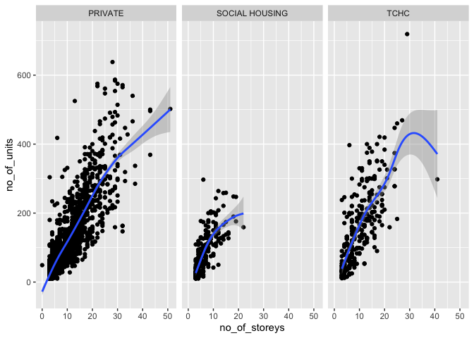
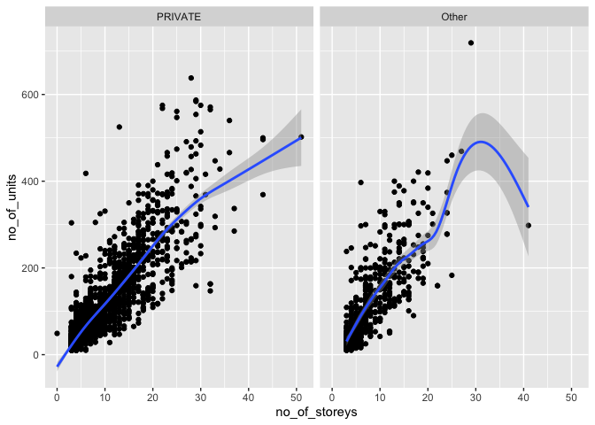
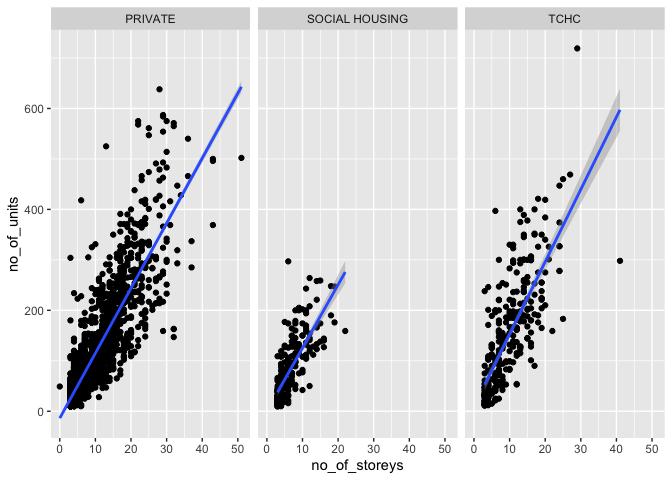

Mini Data Analysis Milestone 2
================

*To complete this milestone, you can edit [this `.rmd`
file](https://raw.githubusercontent.com/UBC-STAT/stat545.stat.ubc.ca/master/content/mini-project/mini-project-2.Rmd)
directly. Fill in the sections that are commented out with
`<!--- start your work here--->`. When you are done, make sure to knit
to an `.md` file by changing the output in the YAML header to
`github_document`, before submitting a tagged release on canvas.*

# Welcome to your second (and last) milestone in your mini data analysis project!

In Milestone 1, you explored your data, came up with research questions,
and obtained some results by making summary tables and graphs. This
time, we will first explore more in depth the concept of *tidy data.*
Then, you’ll be sharpening some of the results you obtained from your
previous milestone by:

-   Manipulating special data types in R: factors and/or dates and
    times.
-   Fitting a model object to your data, and extract a result.
-   Reading and writing data as separate files.

**NOTE**: The main purpose of the mini data analysis is to integrate
what you learn in class in an analysis. Although each milestone provides
a framework for you to conduct your analysis, it’s possible that you
might find the instructions too rigid for your data set. If this is the
case, you may deviate from the instructions – just make sure you’re
demonstrating a wide range of tools and techniques taught in this class.

# Instructions

**To complete this milestone**, edit [this very `.Rmd`
file](https://raw.githubusercontent.com/UBC-STAT/stat545.stat.ubc.ca/master/content/mini-project/mini-project-2.Rmd)
directly. Fill in the sections that are tagged with
`<!--- start your work here--->`.

**To submit this milestone**, make sure to knit this `.Rmd` file to an
`.md` file by changing the YAML output settings from
`output: html_document` to `output: github_document`. Commit and push
all of your work to your mini-analysis GitHub repository, and tag a
release on GitHub. Then, submit a link to your tagged release on canvas.

**Points**: This milestone is worth 55 points (compared to the 45 points
of the Milestone 1): 45 for your analysis, and 10 for your entire
mini-analysis GitHub repository. Details follow.

**Research Questions**: In Milestone 1, you chose two research questions
to focus on. Wherever realistic, your work in this milestone should
relate to these research questions whenever we ask for justification
behind your work. In the case that some tasks in this milestone don’t
align well with one of your research questions, feel free to discuss
your results in the context of a different research question.

# Learning Objectives

By the end of this milestone, you should:

-   Understand what *tidy* data is, and how to create it using `tidyr`.
-   Generate a reproducible and clear report using R Markdown.
-   Manipulating special data types in R: factors and/or dates and
    times.
-   Fitting a model object to your data, and extract a result.
-   Reading and writing data as separate files.

# Setup

Begin by loading your data and the tidyverse package below:

``` r
library(datateachr) # <- might contain the data you picked!
library(tidyverse)
```

    ## Warning: package 'dplyr' was built under R version 4.0.5

# Task 1: Tidy your data (15 points)

In this task, we will do several exercises to reshape our data. The goal
here is to understand how to do this reshaping with the `tidyr` package.

A reminder of the definition of *tidy* data:

-   Each row is an **observation**
-   Each column is a **variable**
-   Each cell is a **value**

*Tidy’ing* data is sometimes necessary because it can simplify
computation. Other times it can be nice to organize data so that it can
be easier to understand when read manually.

### 2.1 (2.5 points)

Based on the definition above, can you identify if your data is tidy or
untidy? Go through all your columns, or if you have \>8 variables, just
pick 8, and explain whether the data is untidy or tidy.

<!--------------------------- Start your work below --------------------------->

We can look at the apt_buildings dataset, given that there are \>8
variables, we will `select` 8 variables to examine. The 8 variables are:
id, air_conditioning, balconies, exterior_fire_escape, fire_alarm,
garbage_chutes, laundry_room, no_of_elevators.

``` r
tidy_apt_buildings <- apt_buildings %>% 
                          select(id, air_conditioning, balconies, exterior_fire_escape, fire_alarm, garbage_chutes, laundry_room, no_of_elevators) %>%
     filter(!is.na(balconies))

print(tidy_apt_buildings)
```

    ## # A tibble: 3,367 × 8
    ##       id air_conditioning balconies exterior_fire_escape fire_alarm garbage_chutes
    ##    <dbl> <chr>            <chr>     <chr>                <chr>      <chr>         
    ##  1 10359 NONE             YES       NO                   YES        YES           
    ##  2 10360 NONE             YES       NO                   YES        YES           
    ##  3 10361 NONE             YES       NO                   YES        NO            
    ##  4 10362 NONE             YES       YES                  YES        NO            
    ##  5 10363 NONE             NO        NO                   YES        NO            
    ##  6 10364 NONE             NO        <NA>                 YES        NO            
    ##  7 10365 NONE             NO        NO                   YES        NO            
    ##  8 10366 CENTRAL AIR      YES       NO                   YES        YES           
    ##  9 10367 NONE             YES       NO                   YES        YES           
    ## 10 10368 NONE             YES       NO                   YES        NO            
    ## # … with 3,357 more rows, and 2 more variables: laundry_room <chr>,
    ## #   no_of_elevators <dbl>

Based off these 8 rows, the data is tidy because of the three principles
it follows: 1. Every variable has its own column. 2. Every observation
has its own row. 3. Each value has its own cell.

<!----------------------------------------------------------------------------->

### 2.2 (5 points)

Now, if your data is tidy, untidy it! Then, tidy it back to it’s
original state.

If your data is untidy, then tidy it! Then, untidy it back to it’s
original state.

Be sure to explain your reasoning for this task. Show us the “before”
and “after”.

<!--------------------------- Start your work below --------------------------->

Since our dataset is tidy, we will be using the `pivot_wider` function
to untidy the data. This will widen the dataset and have a separate
column for each observation of the balconies variable (YES, NO), this
column will take show the values of the no_of_elevators.

``` r
untidy_apt_buildings <- tidy_apt_buildings %>% 
                      pivot_wider(names_from = balconies,
                                  values_from = no_of_elevators)
print(untidy_apt_buildings)
```

    ## # A tibble: 3,367 × 8
    ##       id air_conditioning exterior_fire_escape fire_alarm garbage_chutes
    ##    <dbl> <chr>            <chr>                <chr>      <chr>         
    ##  1 10359 NONE             NO                   YES        YES           
    ##  2 10360 NONE             NO                   YES        YES           
    ##  3 10361 NONE             NO                   YES        NO            
    ##  4 10362 NONE             YES                  YES        NO            
    ##  5 10363 NONE             NO                   YES        NO            
    ##  6 10364 NONE             <NA>                 YES        NO            
    ##  7 10365 NONE             NO                   YES        NO            
    ##  8 10366 CENTRAL AIR      NO                   YES        YES           
    ##  9 10367 NONE             NO                   YES        YES           
    ## 10 10368 NONE             NO                   YES        NO            
    ## # … with 3,357 more rows, and 3 more variables: laundry_room <chr>, YES <dbl>,
    ## #   NO <dbl>

We can use the `pivot_longer` function to retidy the data and make it
look like our original tidy_apt_buildings dataset. Using the print
function, we can compare the two datasets and see that they are the
same.

``` r
new_tidy_apt_buildings <- untidy_apt_buildings %>%
                      pivot_longer(cols = c(YES, NO),
                                           names_to = "balconies",
                                           values_to = "no_of_elevators") 
print(new_tidy_apt_buildings)
```

    ## # A tibble: 6,734 × 8
    ##       id air_conditioning exterior_fire_escape fire_alarm garbage_chutes
    ##    <dbl> <chr>            <chr>                <chr>      <chr>         
    ##  1 10359 NONE             NO                   YES        YES           
    ##  2 10359 NONE             NO                   YES        YES           
    ##  3 10360 NONE             NO                   YES        YES           
    ##  4 10360 NONE             NO                   YES        YES           
    ##  5 10361 NONE             NO                   YES        NO            
    ##  6 10361 NONE             NO                   YES        NO            
    ##  7 10362 NONE             YES                  YES        NO            
    ##  8 10362 NONE             YES                  YES        NO            
    ##  9 10363 NONE             NO                   YES        NO            
    ## 10 10363 NONE             NO                   YES        NO            
    ## # … with 6,724 more rows, and 3 more variables: laundry_room <chr>,
    ## #   balconies <chr>, no_of_elevators <dbl>

``` r
print(tidy_apt_buildings)
```

    ## # A tibble: 3,367 × 8
    ##       id air_conditioning balconies exterior_fire_escape fire_alarm garbage_chutes
    ##    <dbl> <chr>            <chr>     <chr>                <chr>      <chr>         
    ##  1 10359 NONE             YES       NO                   YES        YES           
    ##  2 10360 NONE             YES       NO                   YES        YES           
    ##  3 10361 NONE             YES       NO                   YES        NO            
    ##  4 10362 NONE             YES       YES                  YES        NO            
    ##  5 10363 NONE             NO        NO                   YES        NO            
    ##  6 10364 NONE             NO        <NA>                 YES        NO            
    ##  7 10365 NONE             NO        NO                   YES        NO            
    ##  8 10366 CENTRAL AIR      YES       NO                   YES        YES           
    ##  9 10367 NONE             YES       NO                   YES        YES           
    ## 10 10368 NONE             YES       NO                   YES        NO            
    ## # … with 3,357 more rows, and 2 more variables: laundry_room <chr>,
    ## #   no_of_elevators <dbl>

<!----------------------------------------------------------------------------->

### 2.3 (7.5 points)

Now, you should be more familiar with your data, and also have made
progress in answering your research questions. Based on your interest,
and your analyses, pick 2 of the 4 research questions to continue your
analysis in the next four tasks:

<!-------------------------- Start your work below ---------------------------->

1.  *Are there differences between apartment age (based on year built)
    that allow and don’t allow pets? *
2.  *How does property type influence the number of stories in an
    apartment, and the relationship between stories and units?*

<!----------------------------------------------------------------------------->

Explain your decision for choosing the above two research questions.

<!--------------------------- Start your work below --------------------------->

These two research questions are the most interesting and also offer
multiple approaches to answering/visualizing the research question.
Research question 2 also already has a plot made using faceting
(comparing 3 variables), which is helpful for Task 2. I also think it is
helpful to have a simple (research question 1) and a more complicated
(research question 2) research question.
<!----------------------------------------------------------------------------->

Now, try to choose a version of your data that you think will be
appropriate to answer these 2 questions. Use between 4 and 8 functions
that we’ve covered so far (i.e. by filtering, cleaning, tidy’ing,
dropping irrelevant columns, etc.).

<!--------------------------- Start your work below --------------------------->

We will be using the `filter`, and `select`, and the `mutate` function
to simplify our dataset and make it easier to answer our research
questions. `filter` will remove the NA values from the pets_allowed and
emergency_power variables `select` will select the 3 variables needed to
answer the two research questions `mutate` will add a new variable
(apt_age) which will show the age of the apartment.

``` r
New_Apt_Data <- apt_buildings %>% 
  select(year_built, pets_allowed, property_type, no_of_storeys, no_of_units) %>%
   filter(!is.na(pets_allowed) & !is.na(property_type) & !is.na(no_of_storeys) &!is.na(no_of_units)) %>%
  mutate(apt_age=2022-year_built)

print(New_Apt_Data)
```

    ## # A tibble: 3,365 × 6
    ##    year_built pets_allowed property_type no_of_storeys no_of_units apt_age
    ##         <dbl> <chr>        <chr>                 <dbl>       <dbl>   <dbl>
    ##  1       1967 YES          PRIVATE                  17         218      55
    ##  2       1970 YES          PRIVATE                  14         206      52
    ##  3       1927 YES          PRIVATE                   4          34      95
    ##  4       1959 YES          PRIVATE                   5          42      63
    ##  5       1943 YES          PRIVATE                   4          25      79
    ##  6       1952 YES          PRIVATE                   4          34      70
    ##  7       1959 YES          PRIVATE                   4          14      63
    ##  8       1971 YES          PRIVATE                   7         105      51
    ##  9       1969 YES          PRIVATE                  32         571      53
    ## 10       1972 YES          TCHC                      4         171      50
    ## # … with 3,355 more rows

<!----------------------------------------------------------------------------->

# Task 2: Special Data Types (10)

For this exercise, you’ll be choosing two of the three tasks below –
both tasks that you choose are worth 5 points each.

But first, tasks 1 and 2 below ask you to modify a plot you made in a
previous milestone. The plot you choose should involve plotting across
at least three groups (whether by facetting, or using an aesthetic like
colour). Place this plot below (you’re allowed to modify the plot if
you’d like). If you don’t have such a plot, you’ll need to make one.
Place the code for your plot below.

<!-------------------------- Start your work below ---------------------------->
<!----------------------------------------------------------------------------->

Now, choose two of the following tasks.

1.  Produce a new plot that reorders a factor in your original plot,
    using the `forcats` package (3 points). Then, in a sentence or two,
    briefly explain why you chose this ordering (1 point here for
    demonstrating understanding of the reordering, and 1 point for
    demonstrating some justification for the reordering, which could be
    subtle or speculative.)

2.  Produce a new plot that groups some factor levels together into an
    “other” category (or something similar), using the `forcats` package
    (3 points). Then, in a sentence or two, briefly explain why you
    chose this grouping (1 point here for demonstrating understanding of
    the grouping, and 1 point for demonstrating some justification for
    the grouping, which could be subtle or speculative.)

3.  If your data has some sort of time-based column like a date (but
    something more granular than just a year):

    1.  Make a new column that uses a function from the `lubridate` or
        `tsibble` package to modify your original time-based column. (3
        points)

        -   Note that you might first have to *make* a time-based column
            using a function like `ymd()`, but this doesn’t count.
        -   Examples of something you might do here: extract the day of
            the year from a date, or extract the weekday, or let 24
            hours elapse on your dates.

    2.  Then, in a sentence or two, explain how your new column might be
        useful in exploring a research question. (1 point for
        demonstrating understanding of the function you used, and 1
        point for your justification, which could be subtle or
        speculative).

        -   For example, you could say something like “Investigating the
            day of the week might be insightful because penguins don’t
            work on weekends, and so may respond differently”.

<!-------------------------- Start your work below ---------------------------->

**Task Number**: 1

First we will use the `fct_reorder` function to create another data
frame, with the levels of column `property_type` in *increasing order*
of their `no_of_units` and we will store this into a dataset called
`New_Apt_Data_Units_Ptp`. In other words, we are reordering the
`property_type` according to the `no_of_units`. This may help organize
the 3 plots in a more organized fashion based on the number of units,
rather than it randomly being displayed.

``` r
New_Apt_Data_Units_Ptp <- New_Apt_Data %>%
   mutate(property_type = fct_reorder(property_type, no_of_units))
   
print(New_Apt_Data_Units_Ptp)
```

    ## # A tibble: 3,365 × 6
    ##    year_built pets_allowed property_type no_of_storeys no_of_units apt_age
    ##         <dbl> <chr>        <fct>                 <dbl>       <dbl>   <dbl>
    ##  1       1967 YES          PRIVATE                  17         218      55
    ##  2       1970 YES          PRIVATE                  14         206      52
    ##  3       1927 YES          PRIVATE                   4          34      95
    ##  4       1959 YES          PRIVATE                   5          42      63
    ##  5       1943 YES          PRIVATE                   4          25      79
    ##  6       1952 YES          PRIVATE                   4          34      70
    ##  7       1959 YES          PRIVATE                   4          14      63
    ##  8       1971 YES          PRIVATE                   7         105      51
    ##  9       1969 YES          PRIVATE                  32         571      53
    ## 10       1972 YES          TCHC                      4         171      50
    ## # … with 3,355 more rows

``` r
# Plot using the reordered dataset  
strys_unts_prpty_fctrd <- New_Apt_Data_Units_Ptp %>% 
  # remove the apartment with <4000 units 
  filter(no_of_units<4000) %>%
  ggplot(aes(no_of_storeys, no_of_units)) + facet_wrap(~property_type) + geom_point() + geom_smooth()
print(strys_unts_prpty_fctrd)
```

    ## `geom_smooth()` using method = 'gam' and formula 'y ~ s(x, bs = "cs")'

<!-- -->
<!----------------------------------------------------------------------------->

<!-------------------------- Start your work below ---------------------------->

**Task Number**: 2

We can use the `fct_lump_n` function to group the property types besides
*Private*. We can do this by including `1` (which specifies that we only
want the 1st most frequent property type) following the appropriate
column name (*property_type*). This simplifies our plot as the *Private*
property type took up most of the apartments.

``` r
New_Apt_Data_Othr_Ptp <- New_Apt_Data %>%
  #create a new column which has the new groupings of either Private or Other
    mutate(property_other = fct_lump_n(property_type, 1))
print(New_Apt_Data_Othr_Ptp)
```

    ## # A tibble: 3,365 × 7
    ##    year_built pets_allowed property_type no_of_storeys no_of_units apt_age
    ##         <dbl> <chr>        <chr>                 <dbl>       <dbl>   <dbl>
    ##  1       1967 YES          PRIVATE                  17         218      55
    ##  2       1970 YES          PRIVATE                  14         206      52
    ##  3       1927 YES          PRIVATE                   4          34      95
    ##  4       1959 YES          PRIVATE                   5          42      63
    ##  5       1943 YES          PRIVATE                   4          25      79
    ##  6       1952 YES          PRIVATE                   4          34      70
    ##  7       1959 YES          PRIVATE                   4          14      63
    ##  8       1971 YES          PRIVATE                   7         105      51
    ##  9       1969 YES          PRIVATE                  32         571      53
    ## 10       1972 YES          TCHC                      4         171      50
    ## # … with 3,355 more rows, and 1 more variable: property_other <fct>

``` r
# Plot using the newly created column "property_other"

strys_unts_prpty_other <- New_Apt_Data_Othr_Ptp %>% 
  # remove the apartment with <4000 units 
  filter(no_of_units<4000) %>%
  ggplot(aes(no_of_storeys, no_of_units)) + facet_wrap(~property_other) + geom_point() + geom_smooth()
print(strys_unts_prpty_other)
```

    ## `geom_smooth()` using method = 'gam' and formula 'y ~ s(x, bs = "cs")'

<!-- -->
<!----------------------------------------------------------------------------->

# Task 3: Modelling

## 2.0 (no points)

Pick a research question, and pick a variable of interest (we’ll call it
“Y”) that’s relevant to the research question. Indicate these.

<!-------------------------- Start your work below ---------------------------->

**Research Question**: *How does property type influence the number of
stories in an apartment, and the relationship between stories and
units?*

**Variable of interest**: *no_of_storeys*

<!----------------------------------------------------------------------------->

## 2.1 (5 points)

Fit a model or run a hypothesis test that provides insight on this
variable with respect to the research question. Store the model object
as a variable, and print its output to screen. We’ll omit having to
justify your choice, because we don’t expect you to know about model
specifics in STAT 545.

-   **Note**: It’s OK if you don’t know how these models/tests work.
    Here are some examples of things you can do here, but the sky’s the
    limit.

    -   You could fit a model that makes predictions on Y using another
        variable, by using the `lm()` function.
    -   You could test whether the mean of Y equals 0 using `t.test()`,
        or maybe the mean across two groups are different using
        `t.test()`, or maybe the mean across multiple groups are
        different using `anova()` (you may have to pivot your data for
        the latter two).
    -   You could use `lm()` to test for significance of regression.

<!-------------------------- Start your work below ---------------------------->

Since we are familiar with using something similar to the `lm()`
function (using `geom_smooth`) from Milestone 1 and Task 2, we will use
the same plot which compares the *no_of_storeys* and *no_of_units* and
separates it by *property_type*.

First we will use the `lm()` function to compare the *no_of_storeys* and
*no_of_units*. Then we can use the `geom_smooth` function and specify
the `lm` method to display the relationship.

``` r
lm_storeys_units <- lm(no_of_storeys ~ no_of_units, data = New_Apt_Data_Othr_Ptp)


strys_unts_prpty_lm <- New_Apt_Data_Units_Ptp %>% 
  # remove the apartment with <4000 units 
  filter(no_of_units<4000) %>%
  ggplot(aes(no_of_storeys, no_of_units)) + facet_wrap(~property_type) + geom_point() + geom_smooth(method = 'lm')
print(strys_unts_prpty_lm)
```

    ## `geom_smooth()` using formula 'y ~ x'

<!-- -->

We can see the power of specifying `lm` as the method within
`geom_smooth` if we compare the `strys_unts_prpty_lm` (above) and
`strys_unts_prpty_fctrd` (task 1). Specifying `lm` makes the line
straight along the points.
<!----------------------------------------------------------------------------->

## 2.2 (5 points)

Produce something relevant from your fitted model: either predictions on
Y, or a single value like a regression coefficient or a p-value.

-   Be sure to indicate in writing what you chose to produce.
-   Your code should either output a tibble (in which case you should
    indicate the column that contains the thing you’re looking for), or
    the thing you’re looking for itself.
-   Obtain your results using the `broom` package if possible. If your
    model is not compatible with the broom function you’re needing, then
    you can obtain your results by some other means, but first indicate
    which broom function is not compatible.

<!-------------------------- Start your work below ---------------------------->

We can use the `tidy` function from the `broom` to demonstrate the
summary statistics of the from the fitted model (*lm_storeys_units*).
This approach is preferred to the `summary` function as the `tidy`
function offers a tabular data representation. This provides summary
statistics like the *standard error*

``` r
# load the broom package
library(broom)

#compare using summary and the tidy function

summary(lm_storeys_units)
```

    ## 
    ## Call:
    ## lm(formula = no_of_storeys ~ no_of_units, data = New_Apt_Data_Othr_Ptp)
    ## 
    ## Residuals:
    ##      Min       1Q   Median       3Q      Max 
    ## -138.979   -1.933   -1.270    1.142   27.463 
    ## 
    ## Coefficients:
    ##              Estimate Std. Error t value Pr(>|t|)    
    ## (Intercept) 4.2807179  0.0953410   44.90   <2e-16 ***
    ## no_of_units 0.0383601  0.0006352   60.39   <2e-16 ***
    ## ---
    ## Signif. codes:  0 '***' 0.001 '**' 0.01 '*' 0.05 '.' 0.1 ' ' 1
    ## 
    ## Residual standard error: 4.349 on 3363 degrees of freedom
    ## Multiple R-squared:  0.5203, Adjusted R-squared:  0.5201 
    ## F-statistic:  3647 on 1 and 3363 DF,  p-value: < 2.2e-16

``` r
tidy(lm_storeys_units)
```

    ## # A tibble: 2 × 5
    ##   term        estimate std.error statistic p.value
    ##   <chr>          <dbl>     <dbl>     <dbl>   <dbl>
    ## 1 (Intercept)   4.28    0.0953        44.9       0
    ## 2 no_of_units   0.0384  0.000635      60.4       0

<!----------------------------------------------------------------------------->

# Task 4: Reading and writing data

Get set up for this exercise by making a folder called `output` in the
top level of your project folder / repository. You’ll be saving things
there.

## 3.1 (5 points)

Take a summary table that you made from Milestone 1 (Task 4.2), and
write it as a csv file in your `output` folder. Use the `here::here()`
function.

-   **Robustness criteria**: You should be able to move your Mini
    Project repository / project folder to some other location on your
    computer, or move this very Rmd file to another location within your
    project repository / folder, and your code should still work.
-   **Reproducibility criteria**: You should be able to delete the csv
    file, and remake it simply by knitting this Rmd file.

<!-------------------------- Start your work below ---------------------------->

In task 4.2 from Milestone 1, I made a summary table on the Mean, SD,
and Median of the Number of Storeys per Property Type named
*prprty_typ_smmry*. I will use the `here::here()` function to write it
as a csv file in my `output` folder.

**Property Type Summary - Number of Storeys - Mean, SD, Median:**

``` r
# mean, sd, median
prprty_typ_smmry <- apt_buildings %>% 
  group_by(`property_type`) %>%
  summarise(storey_mean = mean(no_of_storeys, na.rm = TRUE), storey_sd=sd(no_of_storeys, na.rm= TRUE), storey_median=median(no_of_storeys, na.rm=TRUE))
print(prprty_typ_smmry)
```

    ## # A tibble: 3 × 4
    ##   property_type  storey_mean storey_sd storey_median
    ##   <chr>                <dbl>     <dbl>         <dbl>
    ## 1 PRIVATE               7.63      6.40             4
    ## 2 SOCIAL HOUSING        6.58      3.79             5
    ## 3 TCHC                  9.55      5.93             8

``` r
write_csv(prprty_typ_smmry, file=here::here("output", "prprty_typ_smmry.csv"))
```

<!----------------------------------------------------------------------------->

## 3.2 (5 points)

Write your model object from Task 3 to an R binary file (an RDS), and
load it again. Be sure to save the binary file in your `output` folder.
Use the functions `saveRDS()` and `readRDS()`.

-   The same robustness and reproducibility criteria as in 3.1 apply
    here.

<!-------------------------- Start your work below ---------------------------->

First we will write the model from Task 3 to an R binary file using the
`saveRDS()` function and then we can load it again using the `readRDS()`
function.

``` r
# Write the model from Task 3 to an R binary file

saveRDS(lm_storeys_units, file=here::here("output", "lm_storeys_units.rds"))


# Load it again
loaded_lm_storeys_units <- readRDS(file=here::here("output", "lm_storeys_units.rds"))
summary(loaded_lm_storeys_units)
```

    ## 
    ## Call:
    ## lm(formula = no_of_storeys ~ no_of_units, data = New_Apt_Data_Othr_Ptp)
    ## 
    ## Residuals:
    ##      Min       1Q   Median       3Q      Max 
    ## -138.979   -1.933   -1.270    1.142   27.463 
    ## 
    ## Coefficients:
    ##              Estimate Std. Error t value Pr(>|t|)    
    ## (Intercept) 4.2807179  0.0953410   44.90   <2e-16 ***
    ## no_of_units 0.0383601  0.0006352   60.39   <2e-16 ***
    ## ---
    ## Signif. codes:  0 '***' 0.001 '**' 0.01 '*' 0.05 '.' 0.1 ' ' 1
    ## 
    ## Residual standard error: 4.349 on 3363 degrees of freedom
    ## Multiple R-squared:  0.5203, Adjusted R-squared:  0.5201 
    ## F-statistic:  3647 on 1 and 3363 DF,  p-value: < 2.2e-16

<!----------------------------------------------------------------------------->

# Tidy Repository

Now that this is your last milestone, your entire project repository
should be organized. Here are the criteria we’re looking for.

## Main README (3 points)

There should be a file named `README.md` at the top level of your
repository. Its contents should automatically appear when you visit the
repository on GitHub.

Minimum contents of the README file:

-   In a sentence or two, explains what this repository is, so that
    future-you or someone else stumbling on your repository can be
    oriented to the repository.
-   In a sentence or two (or more??), briefly explains how to engage
    with the repository. You can assume the person reading knows the
    material from STAT 545A. Basically, if a visitor to your repository
    wants to explore your project, what should they know?

Once you get in the habit of making README files, and seeing more README
files in other projects, you’ll wonder how you ever got by without them!
They are tremendously helpful.

## File and Folder structure (3 points)

You should have at least three folders in the top level of your
repository: one for each milestone, and one output folder. If there are
any other folders, these are explained in the main README.

Each milestone document is contained in its respective folder, and
nowhere else.

Every level-1 folder (that is, the ones stored in the top level, like
“Milestone1” and “output”) has a `README` file, explaining in a sentence
or two what is in the folder, in plain language (it’s enough to say
something like “This folder contains the source for Milestone 1”).

## Output (2 points)

All output is recent and relevant:

-   All Rmd files have been `knit`ted to their output, and all data
    files saved from Task 4 above appear in the `output` folder.
-   All of these output files are up-to-date – that is, they haven’t
    fallen behind after the source (Rmd) files have been updated.
-   There should be no relic output files. For example, if you were
    knitting an Rmd to html, but then changed the output to be only a
    markdown file, then the html file is a relic and should be deleted.

Our recommendation: delete all output files, and re-knit each
milestone’s Rmd file, so that everything is up to date and relevant.

PS: there’s a way where you can run all project code using a single
command, instead of clicking “knit” three times. More on this in STAT
545B!

## Error-free code (1 point)

This Milestone 1 document knits error-free, and the Milestone 2 document
knits error-free.

Plots failing to show up on Github in the .md counts as an error here.
So does the entire .md failing to show up on Github in the .md (“Sorry
about that, but we can’t show files that are this big right now”).

## Tagged release (1 point)

You’ve tagged a release for Milestone 1, and you’ve tagged a release for
Milestone 2.

### Attribution

Thanks to Victor Yuan for mostly putting this together.
